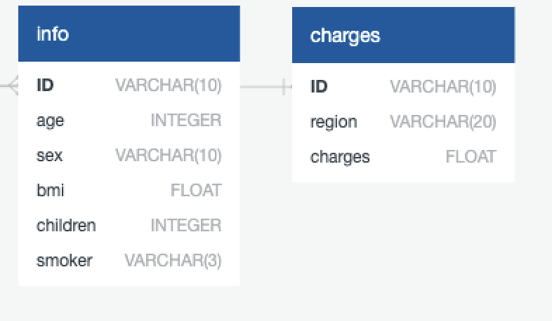
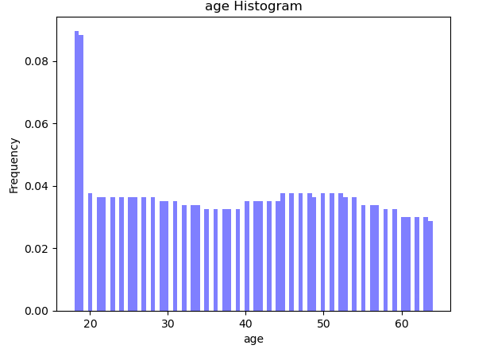
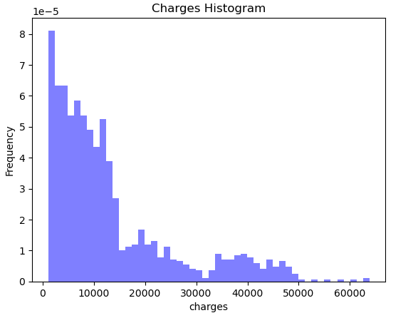
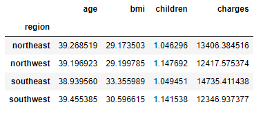
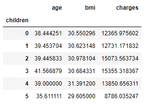
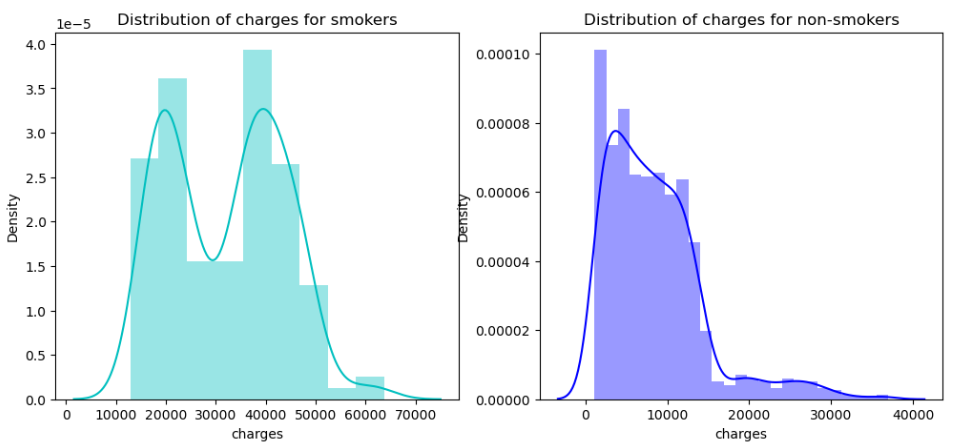
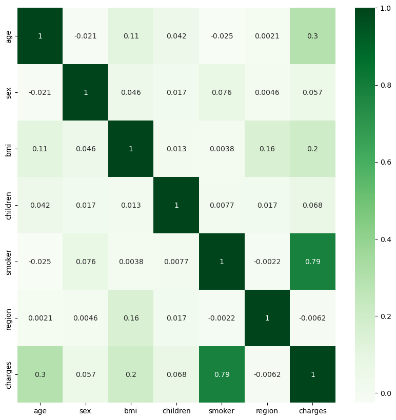

# Predicting Health Insurance Costs

## Roles & Responsibilities
|  Name  | Role Week 1 | Role Week 2 |  Role Week 3 |
|:--------:|:--------:|:--------:|:--------:|
| Massimo | Data Engineer  |  Data Exploration / Presentation |  TBD  |
| Roza | Data Scientist  |  Readme Management / Project Description Write Up  |  TBD  |
| Mark | Project Manager / GitHub Cleanup  |  Presentation / Tabeleau |  TBD  |
| Sandy | Readme Management / Project Description Write Up  |  Data Scientist |  TBD  |

## Background & Rationale

It is well known that how much an individual pays for insurance policies are very case dependent. One person may be paying a lot more than another due to seemingly unknown factors. In the case of health insurance, various lifestyle situations such as being a smoker, having more than one child or even the region you live in has an impact on how much you are charged. 

Therefore, in this project, we set out to create a machine learning algorithm to predict health insurance charges. This knowledge would benefit both insurers and beneficiaries. 

## Research Questions

There are two main questions we wanted to answer in this endeavour: 
1) What model is most predictive of how much someone is charged for health insurance? 
2) What factors in this dataset are most influential of how much someone is charged for health insurance? 

## Dataset 

There are seven columns and 1338 non-null rows in this dataset, columns include: 
* Age: Age of the primary beneficiary
* Sex: Male or Female
* BMI: Body Mass Index of the primary beneficiary
* Children: Number of children covered by health insurance / number of dependents
* Smoker: Smoking status, either Yes or No 
* Region: The US resedential area: Northeast, Northwest, Southeast or Southwest
* Charges: Individual medical costs billed by health insurance 

The source for the dataset is https://www.kaggle.com/datasets/mirichoi0218/insurance

## Database
To hold our data we are using a postgres relational database with two tables. Each patient is assigned a unique Identifier which relates our tables, "info" contains information on each patient and "charges" cointain their insurance charges as well as their location. The Schema is provided in schema.sql as well as a join statement to bring the tables together in joins_queries.sql.

### ERD

## Data Exploration
To explore the data histogram of the columns will show how our data looks like. The age distribution is shown in the next graph

It is looks like that we have data for all ages which is a good start. Now lets take a look at the BMI distribution.

BMI has fairly normal distribution and it should work for our data analysis. Next number of the childeren

This is what we expected, but it should be noted that there is not enough information for higher than 4 childeren in the dataset. Next let's explore our target in machin learning section which is the cost of the health insurance.

It seems that our data is right skewed which means that we will have to deal with it somehow. For now lets explore more and find out if there is relation between sex of the individual to the charges they pay by getting a mean. 

It seems that male individual are paying a bit more than female individuals.

Now lets see if number of chil

## Machine learning method 
In this study we have continuous data for charges, therefore regression method should be used. Generating seaborn heatmap confirms that the charges are very dependent on being smoker or not as we found out in the data exploration phase.

According to this heatmap, smoker, age and BMI are the main contributer and have a strong contribution to the charges column.

Up to now the best result that we got is from Random Forest Regressor. The following pictures are showing predicted model versus actual data for age and bmi. The input for our model are age, sex, BMI, number of children, Being smoker or not and the region. The out put of our model is the individual medical costs billed by the health insurance.

## Dashboard Design
The presentation of the data will be structured in columns across the display. The dashboard features visualizations that represent the main data points prominently on the left side, along with written details which explain the data and the application of this information. The dashboard will feature a large area that will have a space for viewers to input different data points of their own, and these will generate visualizations that correspond to those point. This may be one single chart or several to adequately represent the infomation being called.

