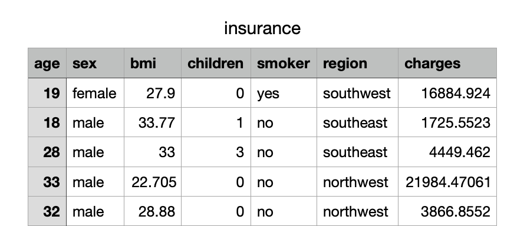
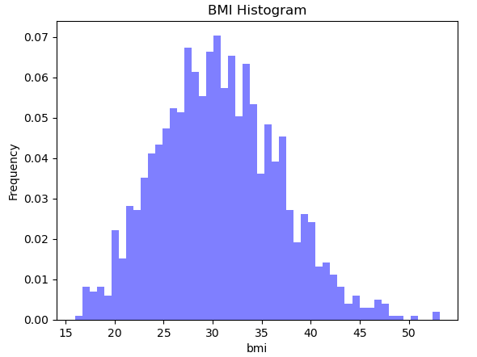
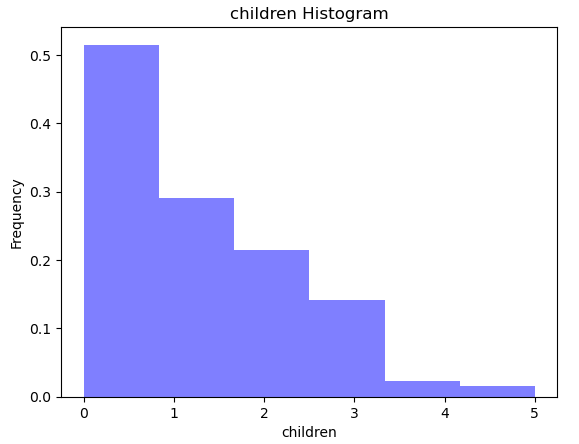
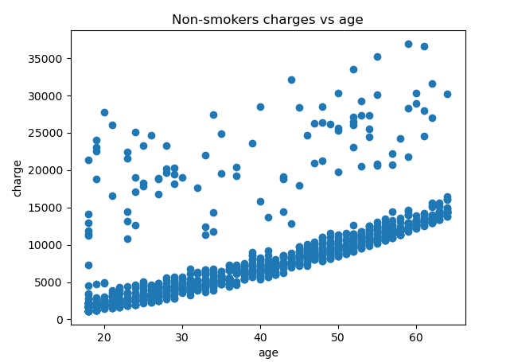
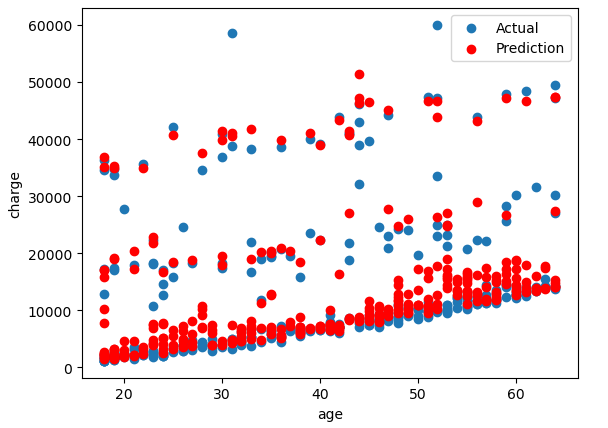
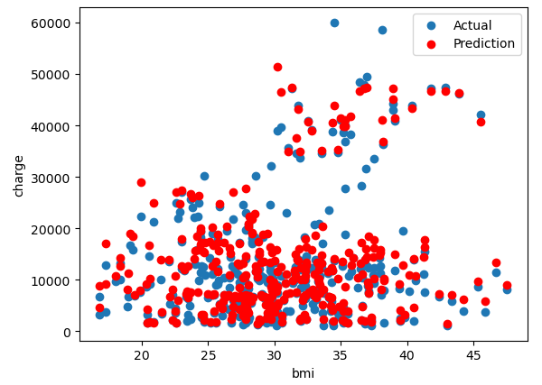

# Predicting Health Insurance Costs
## Background & Rationale

It is well known that how much an individual pays for insurance policies is very case-dependent. One person may be paying a lot more than another due to seemingly unknown factors. In the case of health insurance, various lifestyle situations such as being a smoker, having more than one child or even the region you live in have an impact on how much you are charged. 

Therefore, in this project, we set out to create a machine-learning algorithm to predict health insurance charges. This knowledge would benefit both insurers and beneficiaries. 

## Research Questions

There are two main questions we wanted to answer in this endeavour: 
1) What model is most predictive of how much someone is charged for health insurance? 
2) What factors in this dataset are most influential in how much someone is charged for health insurance? 

## Dataset 

There are seven columns and 1338 non-null rows in this dataset, columns include: 
* Age: Age of the primary beneficiary
* Sex: Male or Female
* BMI: Body Mass Index of the primary beneficiary
* Children: Number of children covered by health insurance/number of dependents
* Smoker: Smoking status, either Yes or No 
* Region: The US residential area: Northeast, Northwest, Southeast, or Southwest
* Charges: Individual medical costs billed by health insurance 

The source for the dataset is https://www.kaggle.com/datasets/mirichoi0218/insurance

## Database
To hold our data, we are using a PostgreSQL relational database with two tables. Each patient is assigned a unique Identifier which relates to our tables. The info table contains information on each patient and the charges table contains their insurance charges as well as their geographical location. The Schema is provided in schema.sql as well as a join statement to bring the tables together in joins_queries.sql.

### ERD

## Data Exploration
To explore the data, a histogram of each column was made. The results of which can be found below. 

Age Distribution - it looks like we have data for all ages, which is a good start! 

BMI Distribution - it seems to be fairly normally distributed, which is great for our subsequent analysis. 

The number of Children Distribution - this is what we expected, but it should be noted that there is not enough information for higher than 4 children in the dataset.

Charges Distribution - as can be seen below, it seems that our data is right skewed with most charges being less than $15,000. 

Next, let's explore more and find out if there is a relation between an individual's sex and the charges they pay. It seems that males pay slightly more than females.

Next, let's take a look at the regions. Similarly, they are close to each other but we can say that the southeast region is paying more but at the same time it has a higher BMI so we need to dig deeper

Now lets check if the number of children has any impact on our data. It seems that an individual with 3 kids has to pay more, but still, this is too early to predict this.

Now lets take a look at the average of charges for each age group. There is an obvious trend here. As can be seen below, the older an individual gets, they incur larger insurance costs.

Finally, let's take a look at the effect of being a smoker. The differnece is huge. It seems that being an smoker is bad for both your health and finances! 

Lets go deeper and separate the charges for smokers and non smokers.

It can be seen that where the non-smoker charges nearly end (around $15,000), a smoker's charges just starts and goes higher! 
Next lets plot them separately with age to see its impact compared to being a smoker.

 

As it can be seen, in the data there are 2 categories in each plot e.g. high paying smokers, low paying smokers, high paying non-smokers and low paying non-smokers. Most of our data is low paying non-smokers that we should be aware of. The difference between high paying and low paying is still under investigation as well.

## Machine Learning 
In this study we have continuous data for charges, therefore various regression models were applied. Generating a heatmap using the seaborn visualization library confirms that the charges are very dependent on being smoker or not as we found out in the data exploration stage.

According to this heatmap, smoker, age and BMI are the main contributers and likely have a large positive impact on the charges (target) column.

The machine learning models that we used are DecisionTreeRegressor, LinearRegression, RandomForestRegressor both with and without a Principal Component Analysis (PCA) and Neural Network. The results are summarized in the next table:

|  Model  | Mean Squared | Root Mean Squared Error | Mean Absolute Error | R-squared | 
|:--------:|:--------:|:--------:|:--------:|:--------:|
| DecisionTreeRegressor |  42,436,815  |  6,514  |  3,029  |  0.69  |
| LinearRegression |  32,729,205  |  5,720  |   3,833  |  0.76  |
| RandomForestRegressor |  25,650,153  |  5,064  |  2,790  |  0.80  |
| PCA & RandomForestRegressor |  22,748,665  |  4,769  |  2,653  |  0.83  |
| Neural Network |  20,663,958  |  4,545  |  2,564  |  0.85  |

Note that our regression model metrics are based on testing scores. 

The best model we were able to configure was a neural network regression model. At the end of our data exploration we found that there are four category of data high paying smokers, low paying smoker, high paying non-smoker and low paying non-smokers. Using PCA help catagorizing this information and adding a column calling it class helps the Random Forest Regressor. The following pictures are showing predicted model versus actual data for age and bmi. The input for our model are age, sex, BMI, number of children, Being a smoker or not and the region. The output of our model is the individual medical costs billed by the health insurance.

## Dashboard Design
The presentation of the data will be structured in columns across the display. The dashboard features visualizations that represent the main data points prominently on the left side, along with written details which explain the data and the application of this information. The dashboard will feature a large area that will have a space for viewers to input different data points of their own, and these will generate visualizations that correspond to those point. This may be one single chart or several to adequately represent the infomation being called.

## Presentation Slides

https://docs.google.com/presentation/d/1ccXkehr4vkpNUo2GSUCvyaj7RNDK-wd1FaVBfYF6Bjg/edit#slide=id.g243120a58ce_0_134

## Conclusion 

To reiterate, we set out to answer two main questions. After exploratory data analysis and the building of many machine learning models, we have answers that we are excited to share. 

1) What model is most predictive of how much someone is charged for health insurance? 

The neural network model provided the lowest mean squared error (MSE), lowest mean absolute error (MAE) and the highest r2 score. This model used an input layer with 2000 neurons and relu as its activation function, 5 hidden layers with 1000, 500, 250, 250 and 150 neurons each using relu for activation and an output layer with 1 neuron a linear activation function. The model used adam as an optimizer and ran for 100 epochs. 
Given the three metrics we used to evaluate our regression models, the neural network proved most predictive of how much someone is charged. 

2) What factors in this dataset are most influential of how much someone is charged for health insurance? 

Being a smoker is one of the most influential parameters for determining health insurance. The next parameters were age and BMI. Parameters such as sex, number of childeren and region are not as important as the rest of parameters.  

## Technologies, languages, tools, and algorithms

Technologies: 

Liberaries that are used : Pandas, numpy, Matplotlib, hvplot, plotly, random, string, pickle, seaborn and sklearn 
Machin learning models used: PCA, LinearRegression, DecisionTreeRegressor, RandomForestRegressor and Neural Network

## Roles, Responsibilities & Project Status
|  Name  | Week 1 Role | Week 2 Role |  Week 3 Role |
|:--------:|:--------:|:--------:|:--------:|
| Massimo | Data Engineer  |  Data Exploration / Tabeleau |  Website  |
| Roza | Data Scientist  |  Readme Management / Project Description Write Up  |  Presentation  |
| Mark | Project Manager / GitHub Cleanup  |  Presentation |  Presentation  |
| Sandy | Readme Management / Project Description Write Up  |  Data Scientist |  Website  |

|    | Data base | Data Exploration | Machine Learning |  Tableau | Website |
|:--------:|:--------:|:--------:|:--------:|:--------:|:--------:|
| Project Status | Completed  | Completed | Completed | Completed | Completed |

